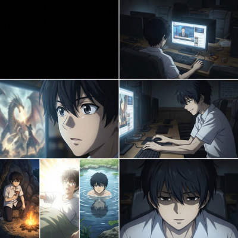
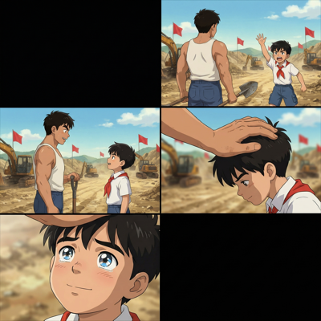

# 视频剪辑自动化流程

专为 **Seedance、Sora2** 等视频生成模型的短剧工作流设计。视频生成模型在批量化制作中存在一批共性缺陷，本项目的各步骤各自针对一类缺陷——**每个步骤均可独立使用**，也可通过 `run_all_v2.py` 一键串联运行。

```
原始视频片段 (1.mp4, 2.mp4, ...)
        │
        ▼ 步骤1  黑屏裁剪 (001remove_black.py)
   修复：分镜首帧黑屏导致的视频开头黑屏淡入
        │
        ▼ 步骤2  声道分离 (002separate.py)
   修复：批量生成中偶发的背景音乐污染
        │
        ▼ 步骤3  转场拼接 (004transition_v2.py)
   修复：单次生成时长受限，片段需拼合 + 场景切换加黑场
        │
        ▼ 步骤4  字幕生成与烧录 (003subtitles_simple.py)
   修复：模型字幕效果不统一，需单独生成字幕
        │
        ▼ 步骤5  AI 选曲 + 剪映草稿 (select_music.py)
   输出：多段 BGM 交叉淡化 + 字幕轨的剪映草稿
        │
        ▼
  百度网盘/JianyingPro Drafts/集数/  ✅
```

---

## 各步骤解决的问题

### 步骤1 — 黑屏裁剪（001remove_black.py）

**背景**：使用 Seedance、Sora2 等主流视频生成模型时，通常以六宫格、九宫格等方式排布分镜图来批量生成视频。为避免模型为衔接上一张分镜图而产生幻觉内容，第一幕分镜图通常设为黑屏。但这导致每段生成视频的开头都会出现「黑屏→淡入」效果。

**本步骤**：检测视频头部的黑帧/低亮度帧，精准裁剪掉黑屏段落，让视频直接从有效内容开始。

<table>
<tr>
<td align="center"><br><sub>分镜首帧为黑屏</sub></td>
<td align="center"><br><sub>分镜首尾帧均为黑屏</sub></td>
</tr>
</table>

---

### 步骤2 — 声道分离（002separate.py）

**背景**：向 Seedance、Sora2 等视频生成模型要求「无背景音乐」，在少量生成时有效，但批量化生成基数增大后，仍会有个别视频混入背景音乐（BGM + 音效 + 人声同时存在）。人工逐一筛查效率极低。

**本步骤**：使用 AI 声道分离模型（Music-Source-Separation）自动提取人声轨道，去除背景音乐，保留音效和人声。

---

### 步骤3 — 转场拼接（004transition_v2.py）

**背景**：Seedance、Sora2 等主流视频生成模型对单次生成时长有限制（通常 15 秒/段），短剧一集需要将数十段片段拼合。直接 concat 最稳定，无需重新编码。此外，连续多段属于同一场景的片段直接拼接，而跨场景的片段之间应加入黑场过渡，以符合短剧的剪辑节奏。

**本步骤**：使用 FFmpeg 将所有片段按数字顺序拼接，对照剧本（Episode-XX.md）预测场景切换位置，在视觉差异超过阈值的片段接合处自动加入淡入淡出 + 黑场，并生成 `_clips.json` 片段清单供后续步骤使用。

---

### 步骤4 — 字幕生成与烧录（003subtitles_simple.py）

**背景**：使用 Seedance、Sora2 等模型生成视频时通常需要标注「无字幕」，因为每段生成的字幕样式不一致，且错别字较多。但即使标注了无字幕，部分片段仍会出现硬字幕（烧录在画面上）。

**本步骤**：
1. **ASR 识别**：使用 Qwen3-ASR 对完整视频做语音识别，生成原始字幕
2. **大模型纠错**：调用 Kimi API，结合剧本台词对 ASR 结果断句纠错
3. **字幕烧录**：将最终字幕文件烧录到视频

<table>
<tr>
<td align="center"><br><sub>硬字幕示例：模型将台词直接烧录进画面</sub></td>
<td align="center"><br><sub>硬字幕示例：即使标注无字幕仍会出现</sub></td>
</tr>
</table>

---

### 步骤5 — AI 选曲 + 剪映草稿（select_music.py）

**背景**：视频生成后需要配乐，从 1000+ 曲目的音乐库中人工挑选耗时且主观。同时，最终剪辑需要在剪映中进行，手动拼装片段轨、BGM 轨、字幕轨重复性极高。

**本步骤**：
1. **AI 选曲**：读取已标注的音乐库，调用 Kimi API 结合剧本情感分析和色彩信息，为不同场景段落各选一段 BGM
2. **草稿生成**：生成剪映草稿文件，包含独立片段轨 + 多段 BGM 交叉淡化 + 字幕轨
3. **自动同步**：将草稿同步到百度网盘，Mac 端剪映可直接打开

---

## 效果预览

以「重生成为超级财阀」第01集为例：

| | 路径 |
|---|---|
| 输入素材 | `assets/重生成为超级财阀/财阀-01/` |
| 最终输出 | [`output/final/重生成为超级财阀/财阀-01.mp4`](output/final/重生成为超级财阀/财阀-01.mp4) |

---

## 项目结构

```
剪辑/
├── run_all_v2.py                 # 🎯 主运行脚本（步骤 1-5 全流程）
├── config.json                   # ⚙️ 配置文件（从 config-example.json 复制）
├── config-example.json           # ⚙️ 配置模板
│
├── scripts/                      # 📜 核心脚本
│   ├── 001remove_black.py        # 步骤1: 黑屏检测与裁剪
│   ├── 002separate.py            # 步骤2: 人声分离（msst conda 环境）
│   ├── 004transition_v2.py       # 步骤3: 转场拼接 + 场景检测
│   ├── 003subtitles_simple.py    # 步骤4: ASR 字幕生成（Qwen3）
│   └── select_music.py           # 步骤5: AI 选曲 + 剪映草稿生成
│
├── skills/                       # 🧠 AI 提示词
│   ├── music_director.md         # Kimi 选曲提示词（含情感分析）
│   └── music_tagger.md           # 音乐库打标提示词
│
├── image-example/                # README 图片说明
│   ├── 001示例/
│   └── 004示例/
│
├── assets/                       # 🎬 素材（不入库）
│   └── [剧名]/
│       ├── [集数]/               # 视频片段文件夹
│       │   ├── 1.mp4 … N.mp4
│       │   └── 封面.jpg
│       └── [剧名]-设定集/        # 剧本文件夹
│           ├── Episode-01.md
│           └── Episode-02.md
│
├── 音乐/                         # 🎵 音乐库（不入库）
│   └── [风格分类]/
│       ├── completed/            # 已打标的音乐
│       │   └── music_tags.json
│       └── [音乐文件.mp3]
│
├── libs/                         # 📚 依赖库（子模块/不入库）
│   └── jianying-editor-skill/    # 剪映草稿生成库
│
├── qwen3-asr-deployment/         # 🎤 ASR 模型部署（子模块）
├── temp_output/                  # 🔄 临时文件（不入库）
└── output/                       # ✅ 输出视频（不入库）
```

---

## 环境准备

### 1. Python 依赖

```bash
pip install requests librosa soundfile numpy
```

### 2. FFmpeg

```bash
# macOS
brew install ffmpeg

# Ubuntu/Debian
sudo apt install ffmpeg

# 验证
ffmpeg -version
```

### 3. Conda 环境（步骤2 人声分离）

步骤2 使用独立 conda 环境运行，避免与主环境的依赖冲突：

```bash
conda create -n msst python=3.10
conda activate msst
pip install torch torchvision torchaudio --index-url https://download.pytorch.org/whl/cu118
pip install librosa soundfile
```

> 声道分离强依赖 GPU，CPU 模式处理速度极慢（建议 8GB+ 显存）。

### 4. Qwen3-ASR（步骤4 字幕生成）

参考 `qwen3-asr-deployment/` 子模块中的说明部署本地 ASR 服务。

### 5. Kimi API（步骤4 纠错 / 步骤5 选曲）

在 [Moonshot 平台](https://platform.moonshot.cn/) 获取 API Key，填入 `config.json`。

### 6. 剪映草稿库

`libs/jianying-editor-skill/` 子模块，用于生成剪映草稿文件。

---

## 配置

```bash
cp config-example.json config.json
# 编辑 config.json，填入 kimi_api_key 和百度网盘路径
```

`config.json` 已加入 `.gitignore`，填入 API Key 后不会提交到仓库。

| 字段 | 必填 | 说明 |
|------|------|------|
| `kimi_api_key` | 是 | 步骤4/5 调用 Kimi API，申请：https://platform.moonshot.cn/ |
| `msst_conda_env` | 是 | 步骤2 使用的 conda 环境名，默认 `msst` |
| `draft_package.windows_sync_path` | 步骤5 | 百度网盘 Windows 本地同步路径 |
| `draft_package.mac_sync_path` | 步骤5 | 百度网盘 Mac 本地同步路径 |
| `draft_package.draft_subfolder` | 步骤5 | 剪映草稿子目录名（如 `JianyingPro Drafts`） |

---

## 素材目录结构

```
assets/
└── 剧名/
    ├── 第01集/
    │   ├── 1.mp4 … N.mp4    # 片段按数字命名
    │   └── 封面.jpg
    └── 剧名-设定集/
        ├── Episode-01.md    # 剧本（用于场景检测和字幕纠错）
        └── Episode-02.md
```

剧本格式（Episode-XX.md）：
```markdown
## 场景 1-1：海边
...台词/场景描述...

## 场景 1-2：大殿
...台词/场景描述...
```

---

## 使用方法

### 完整流程（单集）

```bash
python run_all_v2.py --folder assets/剧名/集数
```

### 批量处理（整剧）

```bash
python run_all_v2.py --folder assets/剧名
# 自动检测子文件夹，逐集处理
```

### 跳过已完成的步骤

```bash
# 只跑转场和选曲（跳过黑屏/分离/字幕）
python run_all_v2.py --folder assets/剧名/集数 --skip 1 2 4

# 只重新选曲生成草稿
python run_all_v2.py --folder assets/剧名/集数 --skip 1 2 3 4

# 只测试转场检测
python run_all_v2.py --folder assets/剧名/集数 --skip 1 2 4 5
```

步骤编号：`1`=黑屏 `2`=分离 `3`=转场 `4`=字幕 `5`=剪映草稿

### 音乐库管理

```bash
# 给新音乐打标签（调用 Kimi 分析）
python scripts/tag_music.py --folder 音乐/风格分类/专辑名

# 打完标签的音乐自动移入 completed/ 子目录
```

`music_tags.json` 格式示例：
```json
{
  "曲目名.mp3": {
    "genre": "国风史诗",
    "mood": ["悲壮", "激昂"],
    "energy": "high",
    "scene": ["战斗", "复仇"]
  }
}
```

---

## 输出结构

```
output/
├── 004output/剧名/集数.mp4       # 转场拼接视频（无字幕）
└── 003output/剧名/集数.mp4       # 字幕烧录视频

scripts/output/subtitle/剧名/集数/
├── 集数_qwen3_optimized.srt
├── 集数_qwen3_optimized.json
└── video/集数.mp4

百度网盘/JianyingPro Drafts/集数/  # 剪映草稿（自动同步）
```

---

## 常见问题

**声道分离失败**

```bash
conda activate msst
python -c "import torch; print(torch.cuda.is_available())"
```

返回 `False` 说明 PyTorch 未识别到 GPU，需重新安装 CUDA 版本的 PyTorch。

**字幕生成失败**

- 确认 Qwen3-ASR 推理服务已启动（参考 `qwen3-asr-deployment/`）
- 确认 `config.json` 中 `kimi_api_key` 有效

**显存不足**

步骤2 显存占用较高，建议 8GB+ 显存。可用 `--skip 2` 跳过，单独测试其他步骤。

---

## 许可证

本项目整合了多个开源工具，请遵守各工具的许可证。
