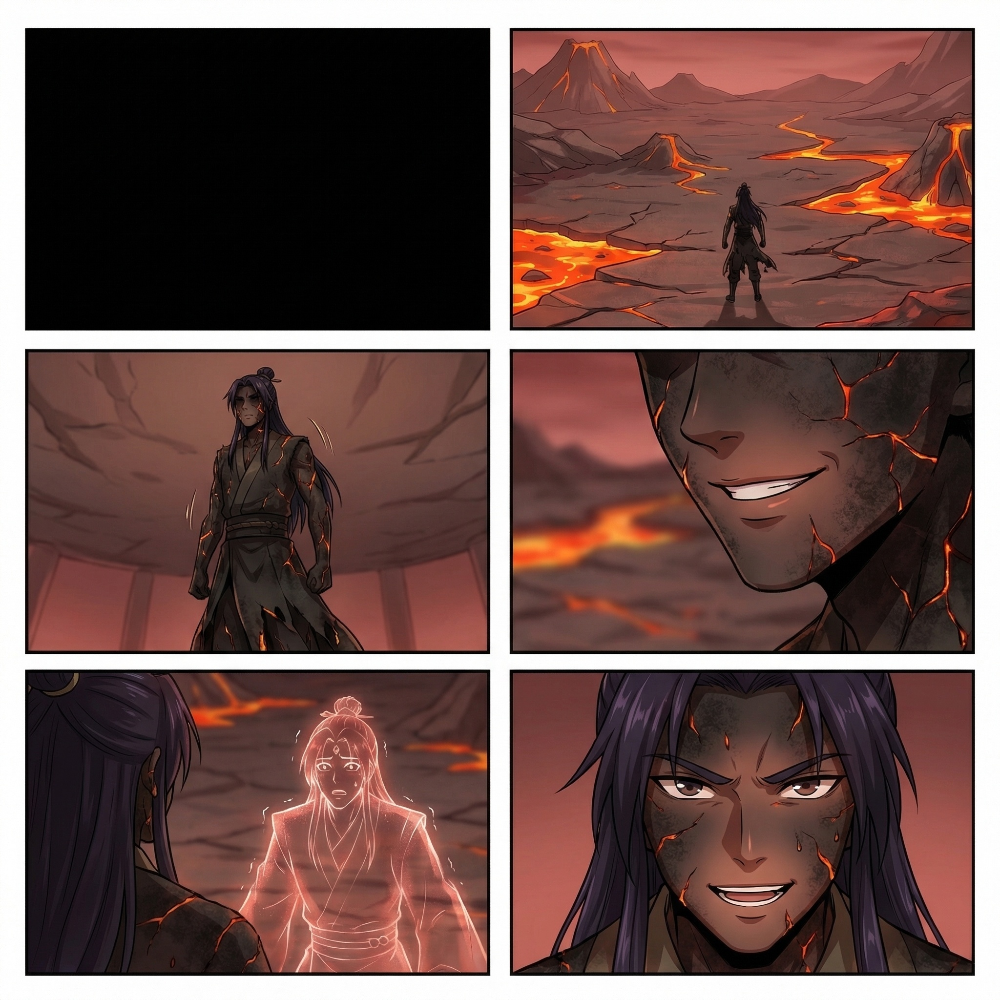
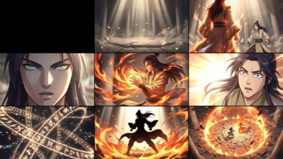
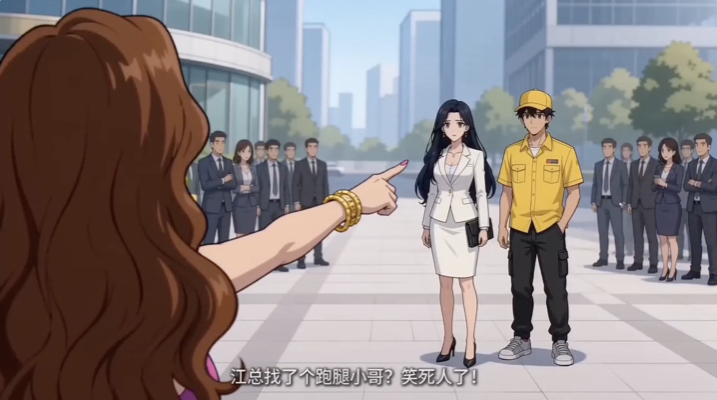

# 视频剪辑自动化流程

专为 **Seedance、Sora2** 等视频生成模型的短剧工作流设计。视频生成模型在批量化制作中存在一批共性缺陷，本项目的四个步骤各自针对一类缺陷——**每个步骤均可独立使用**，也可通过 `run_all.py` 一键串联运行。

```
原始视频片段 (1.mp4, 2.mp4, ...)
        │
        ▼ 步骤1  黑屏裁剪 (001remove_black.py)
   修复：分镜首帧黑屏导致的视频开头黑屏淡入
        │
        ▼ 步骤2  声道分离 (002separate.py)
   修复：批量生成中偶发的背景音乐污染
        │
        ▼ 步骤3  转场拼接 (003transition_simple.py)
   修复：单次生成时长受限，片段需要拼合
        │
        ▼ 步骤4  字幕生成与烧录 (004subtitles.py)
   修复：模型字幕效果不统一，需单独生成字幕
        │
        ▼
  output/final/项目名/集数.mp4  ✅
```

---

## 各步骤解决的问题

### 步骤1 — 黑屏裁剪（001remove_black.py）

**背景**：使用六宫格、九宫格等方式生成分镜图时，第一幕通常设为黑屏。这是为了避免模型为衔接上一张分镜图而产生幻觉内容。但这导致分镜图转视频后，每段视频开头都会出现「黑屏→淡入」效果。

**本步骤**：检测视频头部的黑帧/低亮度帧，精准裁剪掉黑屏段落，让视频直接从有效内容开始。

| 原始分镜首帧（黑屏） |  |
|---|---|
|  |  |

---

### 步骤2 — 声道分离（002separate.py）

**背景**：向视频生成模型要求「无背景音乐」，在少量生成时有效，但批量化生成基数增大后，仍会有个别视频混入背景音乐（BGM + 音效 + 人声同时存在）。人工逐一筛查效率极低。

**本步骤**：使用 AI 声道分离模型（Music-Source-Separation）自动提取人声轨道，去除背景音乐，保留音效和人声。

---

### 步骤3 — 转场拼接（003transition_simple.py）

**背景**：当前主流视频生成模型对单次生成时长有限制（通常 5–10 秒/段），短剧一集需要将数十段片段拼合。直接 concat 最稳定，无需重新编码。此外，本步骤还负责将文件夹中的背景音乐混入最终视频。

**本步骤**：使用 FFmpeg 将所有片段直接拼接为完整集数视频，并自动检索文件夹中的 BGM 文件（`.flac/.mp3/.wav/.m4a`）混音。

---

### 步骤4 — 字幕生成与烧录（004subtitles.py）

**背景**：生成视频时通常需要标注「无字幕」，因为模型为每段生成的字幕样式不一致，且错别字较多。但即使标注了无字幕，部分片段仍会出现硬字幕（烧录在画面上）。

**本步骤**：
1. **ASR 识别**：使用 Qwen3-ASR 对完整视频做语音识别，生成原始字幕
2. **大模型纠错**：调用 Kimi API，结合剧本台词对 ASR 结果断句纠错
3. **硬字幕检测**：调用大模型分析视频，识别哪些时间段模型已生成了硬字幕——这些时间段跳过添加字幕，避免双重字幕叠加
4. **字幕烧录**：将最终字幕文件烧录到视频

| 模型生成的硬字幕示例（需跳过这些时间段） |  |
|---|---|
|  |  |

---

## 效果预览

以「重生成为超级财阀」第01集为例：

| | 路径 |
|---|---|
| 输入素材 | `assets/重生成为超级财阀/财阀-01/` |
| 最终输出 | [`output/final/重生成为超级财阀/财阀-01.mp4`](output/final/重生成为超级财阀/财阀-01.mp4) |

---

## 项目结构

```
video-editing/
├── run_all.py                    # 主运行脚本（串联四个步骤）
├── config-example.json           # 配置示例（复制为 config.json 后填入 API Key）
├── requirements.txt              # Python 依赖
│
├── scripts/
│   ├── 001remove_black.py        # 步骤1: 黑屏检测与裁剪
│   ├── 002separate.py            # 步骤2: 声道分离
│   ├── 003transition_simple.py   # 步骤3: 转场拼接
│   └── 004subtitles.py           # 步骤4: 字幕生成与烧录
│
├── image-example/                # README 图片说明
│   ├── 001示例/
│   └── 004示例/
│
├── tools/
│   └── qwen3-asr-deployment/     # Qwen3-ASR 推理服务部署包
│
└── libs/                         # 依赖库（需手动克隆，见下方说明）
    ├── Music-Source-Separation-Training-GUI/   # 步骤2 声道分离
    └── Qwen3-ASR/                              # 步骤4 语音识别
```

> `temp_output/`、`output/transition/`、`scripts/output/` 均已加入 `.gitignore`，不提交到仓库。

---

## 环境准备

### 1. Python 依赖

```bash
pip install -r requirements.txt
```

### 2. FFmpeg

```bash
# macOS
brew install ffmpeg

# Ubuntu/Debian
sudo apt install ffmpeg
```

### 3. Conda 环境（步骤2 专用）

步骤2 使用独立 conda 环境运行，避免与主环境的依赖冲突：

```bash
conda create -n msst python=3.10
conda activate msst
pip install torch torchvision torchaudio --index-url https://download.pytorch.org/whl/cu118
pip install librosa soundfile
```

> 声道分离强依赖 GPU，CPU 模式处理速度极慢（建议 8GB+ 显存）。

### 4. 依赖库（libs/）

```bash
# 步骤2 声道分离
git clone https://github.com/ZFTurbo/Music-Source-Separation-Training libs/Music-Source-Separation-Training-GUI

# 步骤4 语音识别
git clone https://github.com/QwenLM/Qwen3-ASR libs/Qwen3-ASR
```

下载声道分离模型权重（`.ckpt`）后放入 `libs/Music-Source-Separation-Training-GUI/pretrain/`。

### 5. Qwen3-ASR 模型（步骤4）

下载模型文件（约 4.6GB）后放入 `libs/Qwen3-ASR/models/Qwen3-ASR-1.7B/`：

- Hugging Face：https://huggingface.co/Qwen/Qwen3-ASR-1.7B

参考 `tools/qwen3-asr-deployment/` 中的说明启动推理服务，再运行步骤4。

---

## 配置文件

```bash
cp config-example.json config.json
```

`config.json` 已加入 `.gitignore`，填入 API Key 后不会提交到仓库。

| 字段 | 必填 | 说明 |
|------|------|------|
| `kimi_api_key` | 是 | 步骤4 字幕断句纠错，申请：https://platform.moonshot.cn/ |
| `deepseek_api_key` | 否 | 当前版本暂未启用，留空即可 |
| `msst_conda_env` | 是 | 步骤2 使用的 conda 环境名，默认 `msst` |

---

## 素材文件夹结构

```
assets/
└── 项目名/
    ├── 集数文件夹/              # 文件夹名中需含集数编号
    │   ├── 1.mp4               # 视频片段，必须按数字命名
    │   ├── 2.mp4
    │   ├── bgm.flac            # 背景音乐（可选，支持 flac/mp3/wav/m4a）
    │   └── 封面.jpg            # 封面图（可选）
    └── 项目名-设定集/           # 剧本目录（可选，用于步骤4字幕纠错）
        └── Episode-01.md
```

**集数文件夹命名**：脚本自动从文件夹名提取集数编号，支持 `第01集`、`情深-01`、`朱标-03` 等格式。

---

## 使用方法

### 一键串联运行

```bash
# 处理单集
python run_all.py --folder assets/项目名/集数文件夹

# 批量处理整个项目
python run_all.py --folder assets/项目名
```

批量模式下会先检查每一集的「三要素」（背景音乐、封面、剧本），有缺失则报错停止。

### 跳过已完成的步骤

```bash
# 跳过步骤1、2，从转场拼接开始
python run_all.py --folder assets/项目名/集数文件夹 --skip 1 2

# 只跑字幕生成
python run_all.py --folder assets/项目名/集数文件夹 --skip 1 2 3
```

### 单独运行各步骤

每个脚本均可脱离 `run_all.py` 独立使用：

```bash
# 步骤1: 黑屏裁剪
python scripts/001remove_black.py video.mp4 -o temp_output/

# 步骤2: 声道分离
conda run -n msst python scripts/002separate.py video.mp4 temp_output/

# 步骤3: 转场拼接
python scripts/003transition_simple.py --folder assets/项目名/集数文件夹 -o output.mp4 --bgm bgm.flac

# 步骤4: 字幕生成与烧录
python scripts/004subtitles.py --video output.mp4 --config config.json
```

---

## 输出结构

```
output/
├── transition/项目名/集数.mp4      # 步骤3 拼接后（无字幕）
└── final/项目名/集数.mp4           # 步骤4 字幕烧录后的最终视频

temp_output/项目名/集数/
├── 1_trimmed.mp4                   # 步骤1 黑屏裁剪后
├── 1_trimmed.wav                   # 步骤2 分离用音频
└── 1_trimmed_vocals.mp4            # 步骤2 人声替换后
```

---

## 常见问题

**声道分离失败**

```bash
conda activate msst
python -c "import torch; print(torch.cuda.is_available())"
```

返回 `False` 说明 PyTorch 未识别到 GPU，需重新安装 CUDA 版本的 PyTorch。

**字幕生成失败**

- 确认 Qwen3-ASR 推理服务已启动（参考 `tools/qwen3-asr-deployment/`）
- 确认 `config.json` 中 `kimi_api_key` 有效
- 确认模型文件在 `libs/Qwen3-ASR/models/Qwen3-ASR-1.7B/`

**显存不足**

步骤2 显存占用较高，建议 8GB+ 显存。可用 `--skip 2` 跳过，单独测试其他步骤。

---

## 许可证

本项目基于 [MIT License](LICENSE)。

集成的第三方开源工具，请遵守各自许可证：
- [Music-Source-Separation-Training](https://github.com/ZFTurbo/Music-Source-Separation-Training)
- [Qwen3-ASR](https://github.com/QwenLM/Qwen3-ASR)
